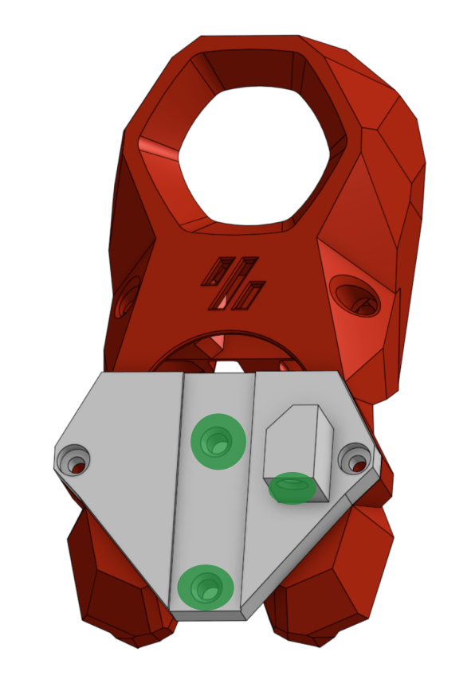
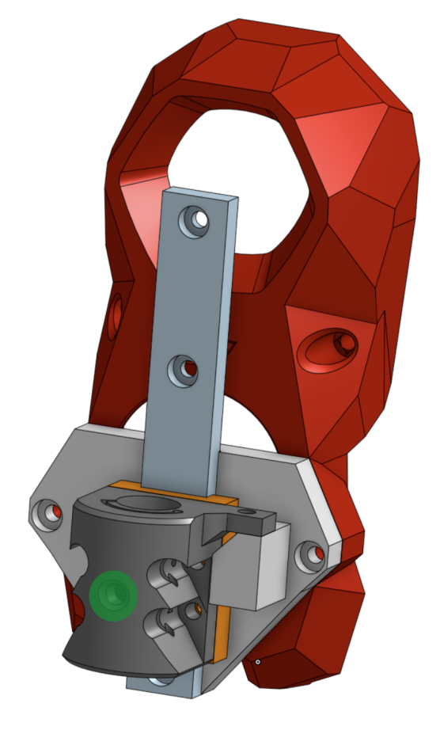

## Voron SB Plotter mod

###### Printing:
- Default voron settings, correct orientation
- No supports needed

###### Bom:
- 7 M3x8
- 5 M3 heatset inserts
- A very long M3 screw - including a long smooth part. 80mm is a good variant.
- A long spring. One harvested from a pen will be fine.
- 2 M3 washers
- MGW7L 100mm linear slide. Any other slide can be used, it's just one that was at hand.
- Sharpie pen.

###### Description:
This is a plotter extension for Voron StealthBurner.
It uses a modified SB main body that includes two additional heatset inserts that the plotter attachment can be screwed to and removed easily.

The STLs supplied are tuned for MGW7L linear slide and regular Sharpie pen. However, most any slide and any pen can be used.

###### Assembly:

There are three printed parts: modified SB body, mounted plate and pen holder.

1. Print all the parts normally. The pen holder should be placed upside-down, this way it can be printed without supports.

2. Install heatsets as indicated.
Pay especial attention to the plate - it is very important for alignment that the inserts are flush or even a bit deep.

,
,
.

3. Install the SB body onto the printer. The rest of the mechanism can be connected to it and disconnected again at will.

4. Screw the linear slide to the plate.

5. Screw the pen holder to the block.

6. Put a washer, a spring and another washer onto the long screw and screw it in from the top into the heatset insert on the limiter.

7. Insert a screw into the heatset in the pen holder.

###### Changing printer.cfg
Include the provider plot.cfg. Modify according to your printer (see comments inside).

###### Preparing Plotter file:

Plotter file must include `PLOT_START` as starter command.
For inkscape, copy the "inkscape/header" and "inkscape/footer" files to the directory where you put the output file.

Run the gcode through inkscape/preprocess.py to make it acceptable by klipper.

###### Running:

:warning: **!!!!! IMPORTANT !!!!!!** To prevent head crash, run the plotter with printer doors open.

Install the adapter (but not the pen) on the head. Run your generated gcode file.

The head should run the homing sequence and stop in the air. Install the pen so that it touches the bed, attach a page to be plotted using masking tape and unpause the printer.

Enjoy!
